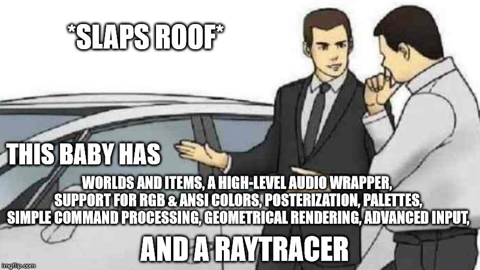

# crack-rabbit

## Wha- why?
Spent a couple months programming the entire game of [Skyrim as a text adventure game](https://github.com/asmoaesl/oblivious) before realizing that it is as generic as almost any text adventure game gets. We need some ingenuity! So, I added shit like easier command processing, items, scenes, audio and images... uhh.. a fucking raytracer, because it all helps you make a really cool text adventure game.

People played text adventure games with nothing but a prompt and input on slow DOS computers because they couldn't just insert their "Kingdom Come: Deliverance" floppy disk in 1984. But people still make text adventure games, and most can be a little calm on the technical side, which is ironic, since text adventure games are generally "programmer games", like how pixel art is "programmer art".

So, instead of reinventing the wheel I will deliver thee a competitive edge:
 - You can now render your 3D scenes as text or images with a neat raytracer (that you do not need to use).
 - Images? As ASCII text? You bet I ~~did~~ **will**.
 - Bet you didn't think to add audio to your text adventure games.
 - GPU accelerated terminal? Yes, because most people playing games have a graphical desktop, but for those that don't: I will still continue to support regular ANSI terminals.
 - Easy but advanced input detection and processing, because text-based games don't always involve typing!
 - My documentation won't suck!
